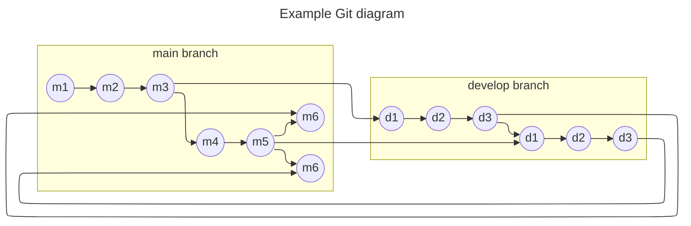

# git

## why using linear commit ?

- At frame 9, we want to commit the devs made in develop branch, to the main branch. The problem is that changes were made to the main branch. One solution is to merge d3 and m5. This solution is a problem :
- can you really trust merge without going through a whole test cycle ?
- appart from cicd, m6 was never really tested.
- the fully tested version d3 is lost when develop branch is deleted.

## solution : rebase

- if you activate linear commit in github, the previous scenario will not be possible : you need to rebase before pushing a MR
- if you rebase, there is no need for a merge, because the new head of main will be exactly the head of develop
- d3 == m6 : the new head of main will be fully tested
- this version will always be available in the main branch history

